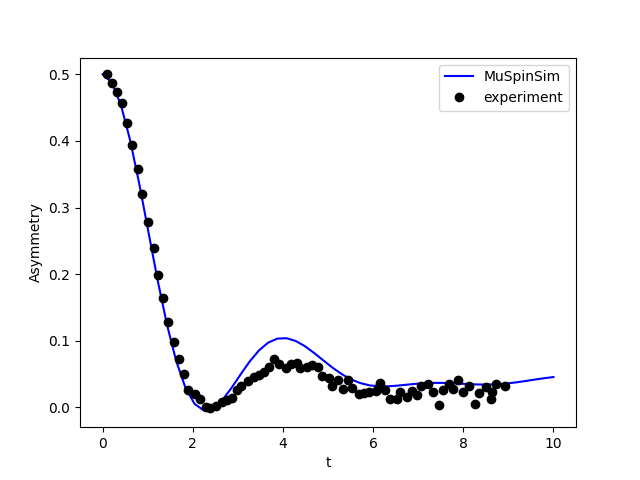

# Examples
Here we go over a few examples of usage of MuSpinSim which cover some common use cases. The examples can be found in the `examples` folder.

## Example 1 - Zeeman coupling
**Input file:** `examples/zeeman/zeeman.in`

This is a very simple example of a single muon with a static magnetic field - a Zeeman interaction. The field is set to be

```plaintext
zeeman 1
    0 0 20.0/muon_gyr
```

Being aligned with the *z* axis, it will produce a full precession of the entire muon polarisation, and given the field is defined as a function of the muon gyromagnetic ratio, it will result in a Larmor frequency of $\gamma_\mu B = 20 \,\mathrm{MHz}$, meaning it will do two full precessions in the 0.1 µs range covered by the time axis.


## Example 2 - Hyperfine coupling
**Input file:** `examples/hfine/hfine.in`

This example is for the simplified case of a muon and an electron with isotropic hyperfine coupling and zero magnetic field. The hyperfine tensor has a Fermi contact term of 10 MHz:

```plaintext
hyperfine 1
    10   0    0
    0    10   0
    0    0    10
```

so we expect an oscillation of the muon's polarisation at that frequency.


## Example 3 - Hyperfine coupling (with powder averaging)
**Input file:** `examples/hfine_powder/hfine_powder.in`

A similar example as the first, but this time, an anisotropic hyperfine tensor including a dipolar part is used:

```plaintext
hyperfine 1
    5    2    3
    2    5    2
    3    2    5
```

In addition, a full averaging over 1,000 solid angles is carried out:

```plaintext
orientation
    eulrange(10)
```

Each of these orientations will contribute an oscillation like the one above with a slightly different frequency. The overall sum of all contributions ends up decaying due to the dephased individual oscillations cancelling out.


## Example 4 - Avoided Level Crossing
**Input file:** `examples/alc/alc.in`

A simple example of an Avoided Level Crossing experiment involving three spins: a muon, an electron, and a hydrogen atom. Both the muon and the hydrogen are coupled to the electron by the hyperfine interaction. The tensors are orientation dependent, and an average is carried out over different orientations (because this is an experiment with longitudinal polarisation, the `zcw` averaging should be sufficient, and is much cheaper than `eulrange`). The result can be seen as one major $\Delta_1$ peak around 2.1 T and a much smaller $\Delta_0$ one at 2.3 T.


## Example 5 - Finite temperature
**Input files:** `examples/temperature/low_T.in`, `examples/temperature/high_T.in`

In this example we look at the effect of temperature on the starting density matrix of the system, and how it affects the final result. We work with a system very similar to that of [example 2](#example-2---hyperfine-coupling), with the difference that we add an external static field of 1 T. This means that the difference in energy between the "up" and "down" states for the electron is given by:

$$
\Delta E = 2\pi\hbar \gamma_e \cdot (1 \,\mathrm{T}) =  2\pi\hbar \cdot (28024.95 \,\mathrm{MHz}) \approx 1.159\cdot 10^{-4} \,\mathrm{eV}
$$

The scale of this energy is much higher than anything that can come out of the hyperfine coupling between electron and muon (only 10 MHz), so we're safely in the area of validity of the high field approximation. In terms of temperature scale, we expect the high temperature ($T \approx \infty$) regime will be valid for

$$
T \gg \frac{1.159\cdot 10^{-4} \,\mathrm{eV}}{ k_B} \approx 1.35 \,\mathrm{K}.
$$

For this reason, we make a comparison between two versions of the same system, one with $T=\infty$ and one with $T = 1 \,\mathrm{K}$, low enough to be out of the high temperature regime. The expected behaviour is as follows:

* the external field sets a base Larmor frequency of 135.54 MHz for the muon. The hyperfine interaction adds or subtracts 5 MHz based on whether the electron is up or down;
* for very low T, the electron will start entirely in one state, aligned with the external magnetic field. In this case we expect the signal to be a single cosinusoid at 140.54 MHz;
* for very high T, the electron will be in a statistical ensemble of up and down state, and we expect the signal to be an average of two cosinusoids at 140.54 and 130.54 MHz respectively.

We can see the trends very obviously in the figure below. The high temperature limit corresponds to the sum of two slightly dephased cosinusoids, while the low temperature example is closer to a single wave. You can try experimenting with changing the temperature and re-running the simulation to see how it affects the result.


## Example 6 - Dissipation
**Input file:** `example/dissipation/dissipation.in`

This example shows exactly the case that was solved analytically in the [theory section about the Lindbladian](./theory_2.md#a-simple-example). A system is set up with a single muon polarised in the *x* direction, a perpendicular field, and a dissipation constant. The system is defined as follows:

```plaintext
field
    2.0/muon_gyr
dissipation 1
    5.0
```

Thus, following the theory as described, we expect to observe a signal that has the equation

$$
A(t) = \frac{1}{2} \cos(4\pi t)e^{-5t} 
$$

where the time is in microseconds. We can in fact see this exact result in the figure below:


## Example 7 - Fluorine
**Input files:** `examples/fluorine/fluorine_zf.in`, `examples/fluorine/fluorine_tf.in`

This example draws inspiration from an important paper in muon science, namely:

> J. H. Brewer, S. R. Kreitzman, D. R. Noakes, E. J. Ansaldo, D. R. Harshman, and R. Keitel
> [Observation of muon-fluorine "hydrogen bonding" in ionic crystals](https://doi.org/10.1103/PhysRevB.33.7813)
> *Phys. Rev. B 33, **7813(R)** – Published 1 June 1986*

In this paper, it was observed that in some ionic fluorides, muons tend to form a $\mathrm{F}-\mu-\mathrm{F}$ complex that then becomes recognisable due to the specific signature of the dipolar coupling of the muon with the two fluorine nuclei. The input file uses the paper's estimated distances for NaF (sodium fluoride) for both Zero Field (ZF) and Transverse Field (TF) cases. 
Dipolar couplings are defined taking into account that the bond is in the $\langle 110\rangle$ direction in the crystal:

```plaintext
dipolar 1 2
    0.82731493 0.82731493 0
dipolar 1 3
    -0.82731493 -0.82731493 0
```
 
while the muon starts polarised along *x*, namely, the $\langle 100\rangle$ direction. Let's first look at the TF case. Here the field is aligned to the $\langle 111 \rangle$ direction and has an intensity of 220 Oe (corresponding to 0.022 T):

```plaintext
field
    1.27e-2 1.27e-2 1.27e-2                         # Original paper uses field in Oe, direction <111>
```

This result is meant to be compared with Fig. 1 of the paper:


 One can see the similarity at the beginning, though at longer time scales, the experimental data decays a lot more quickly. This is due to how in the real experiment, of course, there aren't just *three* spins - there is a whole lattice of them. The fluorine nuclei in particular interact with other neighbouring nuclei via dipolar coupling, and that ends up causing a phenomenon known as 'spin diffusion' in which the polarisation is irreversibly dispersed throughout the crystal, and thus the muon loses it almost entirely.
 
 Here is instead the ZF experiment. This is meant to be compared with Fig. 3 of the paper, the bottom left quadrant:
 
 
 
 Again, the same principle holds, as the similarity is stronger for $t \lt 4 \,\mu\mathrm{s}$ and then is lost as the effect of spin diffusion becomes more pronounced.
 
## Example 8 - Fluorine with dissipation
**Input files:** `examples/fluorine_dissipation/fluorine_tf_dissip.in` and `examples/fluorine_dissipation/fluorine_zf_dissip.in`
 
 We saw above how the simulation of the $\mathrm{F}-\mu-\mathrm{F}$ complex is accurate only at short time due to spin diffusion affecting the system. We can, however, try to approximate the effect of spin diffusion too. To this end we add dissipative terms to the two fluorine nuclei, as a way to represent the effect of exchange with the reserve of other fluorine spins in the crystal. The couplings here have been worked out to match the experimental result.
 
```plaintext
dissipation 2
    0.1
dissipation 3
    0.1
```

The results in this way show a marked decay towards the end of the plot, for both transverse field:


 and zero field:
 
 
 
and if you can compare with the original paper, you can notice how these are already much more similar to the look of the experimental results.

## Example 9 - Fitting
**Input file:** `examples/fitting/fitting.in`

Now, we look at how we can fit some data with MuSpinSim. Here we use again the same system seen in the [dissipation example](#example-6---dissipation), but we use some fake simulated data (found in `examples/fitting/experiment.dat`) calculated from the analytical solution to the problem with some added random noise. The data is formatted in two columns and normalised so that it begins around 0.5 intensity, and then is loaded in the input file:

```plaintext
fitting_data
    load("experiment.dat")
```

Then we define a variable `g` with a starting value of 0.1 and comprised between 0 and $+\infty$ and use it to define the dissipation:

```plaintext
fitting_variables
    g 0.1 0.0 inf
dissipation 1
    g
```

Running this example will take a bit longer than the others, as the program needs to evaluate the function a lot of times to find the correct value. At the end, it should converge on a value close to `g = 3.0`, and as we can see here, the fitted function matches the fake data quite well:


## Example 10 - Celio's Method
**Input file:** `examples/celio/celio.in`

Finally, we look at how we can use Celio's method to approximate a large system with MuSpinSim. Here we give an example of $\text{V}_3\text{Si}$ as described in the paper

> Pietro Bonfà, Jonathan Frassineti, John M. Wilkinson, Giacomo Prando, Muhammad Maikudi Isah, Chennan Wang, Tiziana Spina, Boby Joseph, Vesna F. Mitrović, Roberto De Renzi, Stephen J. Blundell, and Samuele Sanna
> [Entanglement between Muon and $I > \frac{1}{2}$ Nuclear Spins as a Probe of Charge Environment](https://doi.org/10.1103/PhysRevLett.129.097205)
> *Phys. Rev. Lett. **129**, 097205 – Published 26 August 2022*

In brief, this system consists of Si atoms each with 0 spin, and Vanadium atoms each with a spin $\frac{7}{2}$. Since the Si atoms have 0 spin, we only consider interactions between the muon and the Vanadium atoms. We now want to find 4 closest Vanadium atoms to the muon stopping site and consider their dipole interactions with the muon as well as their quadrupole interactions. To do this we use [GIPAW](http://www.gipaw.net/) from [Quantum ESPRESSO](https://www.quantum-espresso.org/) to compute the EFG tensors required for the quadrupole interactions and use the [`muspinsim-gen`](./tools/#muspinsim-gen) tool to construct the beginnings of our input file using the command `muspinsim-gen ./V3Si_SC.cell 6 --dipolar --quadrupolar ./gipaw.out --ignore_symbol Si --out V3Si.in`. We then give it a name and define the time range we want to compute the asymmetry values for using

```plaintext
name
    celio
time
    range(0, 10, 50)
```

Then we average over simulations with muons initially polarised in the x, y and z directions by adding

```plaintext
polarization
    1 0 0
    0 1 0
    0 0 1
average_axes
    polarization
```

Finally we request that MuSpinSim uses Celio's method using

```plaintext
celio
    10 4
```

Where the first value is the trotter number $k = 10$, and the second value gets MuSpinSim to randomise the initial states and compute the average of 4 simulations for each initial polarisation direction.

Running this example will take longer than the others due to the size of the problem (in this case we have a Hilbert space of dimension $2\times8^4 = 8192$), but without using Celio's method it would have taken many times longer and would require a lot more memory. The result looks like Figure 2(a) in the paper:

